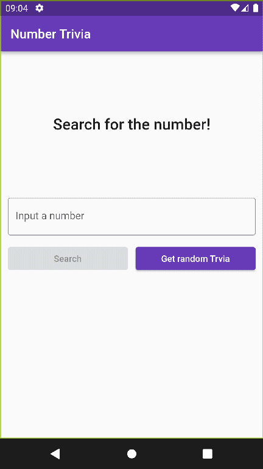

# number_trivia

An application shows trivia obout given numbers. It was written using TDD

## Screenshots

## Development

project uses couple dependencies like:
- [http](https://pub.dev/packages/http)
- [flutter_bloc](https://pub.dev/packages/flutter_bloc)
- [shared_preferences](https://pub.dev/packages/shared_preferences)
- [get_it](https://pub.dev/packages/get_it)
- [internet_connection_checker](https://pub.dev/packages/internet_connection_checker)

and dev dependencies
- [bloc_test](https://pub.dev/packages/bloc_test)
- [mockito](https://pub.dev/packages/mockito)

Full dependency list as usual in pubspec.yaml file.

## How to run

Application was designed for android devices (smartphone), but it should work on IOS (not tested).
I assume that You allready have Flutter SDK and Android virtual device installed. 

To run application:

- Download repository ZIP file or if You have Git clone repository to Your hard drive.
- Run Android virtual device.
- Open CMD and navigate to repository location.
- In command line type "flutter run" - if your virtual device is detected, flutter will automatically launch the application on the device.
